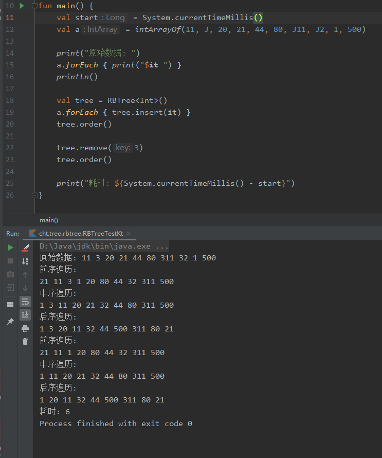
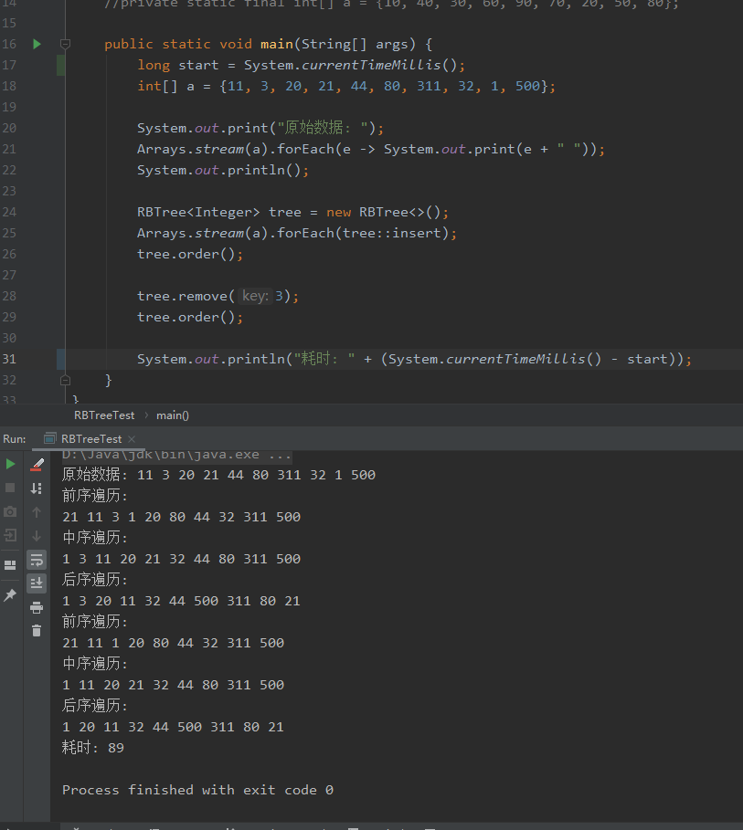
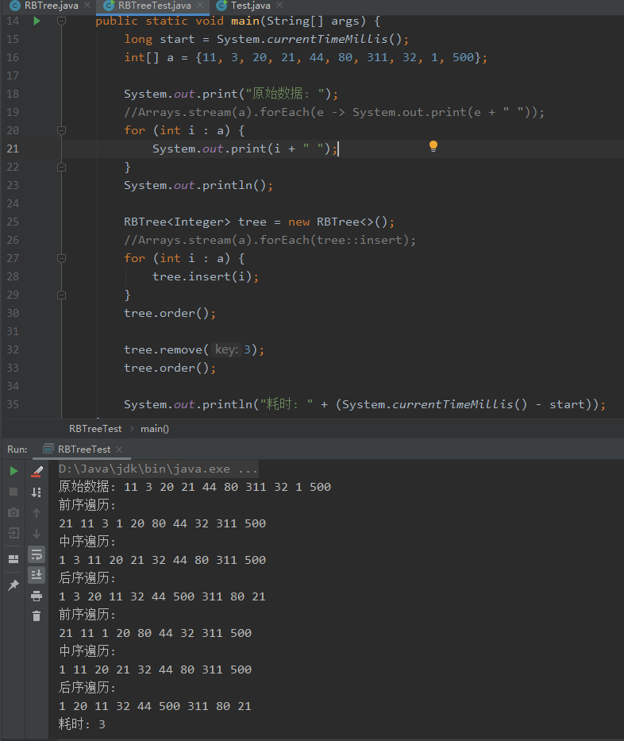

# 红黑树 kotlin 实现
> 根据Java实现，因此可能部分代码会带有Java的痕迹，例如判空  
> 序：语法糖真好吃，判空舒服的一批
### 红黑树基本概念
> 基于此文来描述 [漫画:什么是红黑树](https://mp.weixin.qq.com/s/jz1ajDUygZ7sXLQFHyfjWA)
>> 因为懒得放图，所以只说明一些关键原理
#### 先了解二叉查找树  
二叉查找树（BST）具备什么特性呢？

> 1. 左子树上所有结点的值均小于或等于它的根结点的值。  
> 2. 右子树上所有结点的值均大于或等于它的根结点的值。  
> 3. 左、右子树也分别为二叉排序树。 

**但是多次插入新节点后可能导致不平衡，因此需要红黑树**

> 红黑树 (Red Black Tree) 是一种自平衡的二叉查找树，除了符合二叉查找树的基本特征外，
它还具有下列的附加特性：
>> 1. 节点是红色或黑色。  
>> 2. 根节点是黑色。  
>> 3. 每个叶子节点都是黑色的空节点（NIL节点）。  
>> 4. 每个红色节点的两个子节点都是黑色。(从每个叶子到根的所有路径上不能有两个连续的红色节点)  
>> 5. 从任一节点到其每个叶子的所有路径都包含相同数目的黑色节点。

### 一些关键概念
左旋转：逆时针旋转红黑树的两个节点，使得父节点被自己的右孩子取代，而自己成为自己的左孩子。
```$代码大致如此
    /**
     * 对红黑树的节点(a)进行左旋转
     *
     * 左旋示意图(对节点a进行左旋)：
     *      pa                              pa
     *     /                               /
     *    a                               b
     *   /  \      --(左旋)-.           / \                #
     *  la   b                          a  rb
     *     /   \                       /  \
     *    lb   rb                     la  lb
     *
     * @param a 左旋的节点
     */
    private fun leftRotate(a: RBTNode<T>) {
        // a的右节点
        val b: RBTNode<T>? = a.right
    
        // b的左节点变为a的右节点
        a.right = b?.left
    
        // 这里使用了kotlin的 ?. 判断符，表达式左侧任意为null，就跳过
        b?.left?.parent = a
    
        b?.parent = a.parent
            
        if (a.parent == null) {
            this.root = b
        } else {
            if (a.parent?.left == a) {
                a.parent?.left = b
            } else {
                a.parent?.right = b
            }
        }
    
        b?.left = a
        a.parent = b
    }
```

右旋转：顺时针旋转红黑树的两个节点，使得父节点被自己的左孩子取代，而自己成为自己的右孩子。
```$代码也是大致如此
    /**
     * 对红黑树的节点(b)进行右旋转
     *
     * 右旋示意图(对节点b进行左旋)：
     *            pb                               pb
     *           /                                /
     *          b                                a
     *         /  \      --(右旋)-.            /  \                     #
     *        a   rb                           la   b
     *       / \                                   / \                   #
     *      la  ra                                ra  rb
     *
     * @param b 右旋的节点
     */
    private fun rightRotate(b: RBTNode<T>) {
        val a = b.left

        b.left = a?.right

        a?.right?.parent = b

        a?.parent = b.parent

        if (b.parent == null) {
            this.root = a
        } else {
            if (b.parent?.left == b) {
                b.parent?.left = a
            } else {
                b.parent?.right = a
            }
        }

        a?.right = b
        b.parent = a

    }
```

##### DLC
> 1. 红黑树复杂度 O(log n)
> 2. 红黑树不会变成 二叉~~（瘸子）~~查找树
> 3. Java中TreeMap和TreeSet的底层是红黑树，1.8里，HashMap也用到了红黑树，根据源码，大于8时，才会采用红黑树，但是代码可读性略差，不是很好懂，因此借鉴了网上博客的内容。另外，Java8中，HashMap只有数据大于8时才会转为红黑树，这个看文档说是
>> Because TreeNodes are about twice the size of regular nodes, we use them only when bins contain enough nodes to warrant use (see TREEIFY_THRESHOLD). And when they become too small (due to removal or resizing) they are converted back to plain bins. In usages with well-distributed user hashCodes, tree bins are rarely used. Ideally, under random hashCodes, the frequency of nodes in bins follows a Poisson distribution (http://en.wikipedia.org/wiki/Poisson_distribution) with a parameter of about 0.5 on average for the default resizing threshold of 0.75, although with a large variance because of resizing granularity. Ignoring variance, the expected occurrences of list size k are (exp(-0.5) * pow(0.5, k) / factorial(k)). The first values are:  
   0: 0.60653066  
   1: 0.30326533  
   2: 0.07581633  
   3: 0.01263606  
   4: 0.00157952  
   5: 0.00015795  
   6: 0.00001316  
   7: 0.00000094  
   8: 0.00000006  
   more: less than 1 in ten million  
   简单解释一下，理想情况下，在随机哈希代码下，桶中的节点频率遵循
   泊松分布，文中给出了桶长度k的频率表。
   由频率表可以看出，桶的长度超过8的概率非常非常小。所以作者应该是根据
   概率统计而选择了8作为阀值。

##### 后续
>相同的代码，kotlin比Java快?
>   
>  
> 

##### 后续++
>Java还是要快一点？主要是stream耗时太久
> 